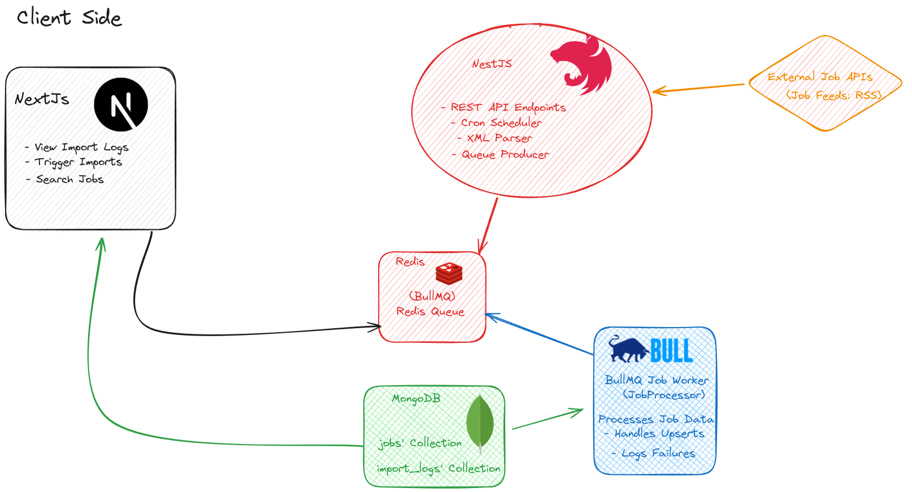

# 🚀 Scalable Job Importer System

A robust job import system that fetches job data from external APIs, processes them efficiently using a Redis-backed queue, stores them in MongoDB, and provides an admin interface for monitoring.

## ✨ Features

-   **Multi-source Data Fetching**: Integrates with various external RSS job feeds (Jobicy, HigherEdJobs).
-   **Queue-based Processing**: Utilizes **Redis & BullMQ** for reliable, asynchronous background job handling.
-   **Automated & Manual Imports**: Supports hourly cron-scheduled and on-demand manual import triggers.
-   **Comprehensive History Tracking**: Logs `totalFetched`, `newJobs`, `updatedJobs`, and `failedJobs` for each import run in a dedicated MongoDB collection.
-   **Searchable Job Listings**: Provides an admin UI to search and filter all imported jobs.
-   **Scalable Architecture**: Designed for modularity (NestJS modules, services, DTOs) to enable future microservice evolution.
-   **Robust Error Handling**: Includes retry logic for jobs and comprehensive logging for import failures.
-   **Interactive Admin UI**: Built with Next.js (Shadcn UI, Tailwind CSS) for monitoring import history and job data.

## 🏗️ Architecture

├── client/              # Next.js frontend application
│   ├── src/
│   │   ├── app/         # App Router pages (e.g., /import-logs, /jobs)
│   │   ├── components/  # Reusable UI components (Shadcn UI, custom)
│   │   ├── lib/         # Frontend utilities and API clients (e.g., api.ts)
│   │   └── types/       # Shared TypeScript types for API responses
│   └── package.json
├── server/              # Nest.js backend application
│   ├── src/
│   │   ├── common/      # Global utilities (e.g., ErrorHandler, DTOs)
│   │   ├── config/      # Environment-dependent configurations
│   │   ├── jobs/        # Core job import logic module
│   │   │   ├── controllers/ # API endpoints for jobs and import logs
│   │   │   ├── dto/         # Data Transfer Objects
│   │   │   ├── schemas/     # Mongoose schemas (Job, ImportLog)
│   │   │   ├── services/    # Business logic for fetching, queuing, searching
│   │   │   └── my-job.processor.ts # BullMQ Worker for job processing
│   │   ├── main.ts      # Application entry point, CORS config
│   │   └── app.module.ts # Root module, BullMQ setup, cron scheduling
│   └── package.json
├── docs/                # Project documentation
│   └── architecture.md
├── .env.example         # Example environment variables
└── README.md

🛠️ Technology Stack

Backend

    Node.js with NestJS and TypeScript

    MongoDB with Mongoose (ODM)

    Redis with BullMQ for job queuing

    Axios for external API calls

    xml2js for XML parsing

    @nestjs/schedule for cron jobs

Frontend

    Next.js 14 (App Router)

    React with TypeScript

    Tailwind CSS for styling

    Shadcn UI for UI components

    use-debounce for input optimization

⚡ Quick Start

Prerequisites

    Node.js (v18 or higher)

    MongoDB (local or Atlas)

    Redis (local or Redis Cloud)

    Configure Environment Variables:
Create a .env file in the server/ directory based on .env.example:
Code snippet

PORT=
MONGO_URI=
REDIS_CONNECT_URL=
REDIS_HOST=
REDIS_PORT=
REDIS_PASSWORD=

Replace YOUR_REDIS_PASSWORD and redis-host:port with your actual Redis Cloud credentials.